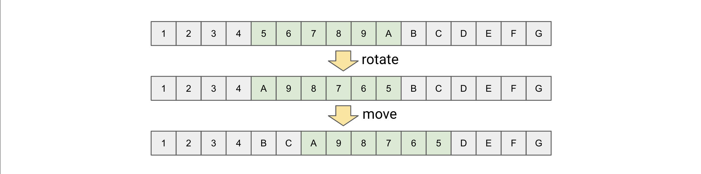
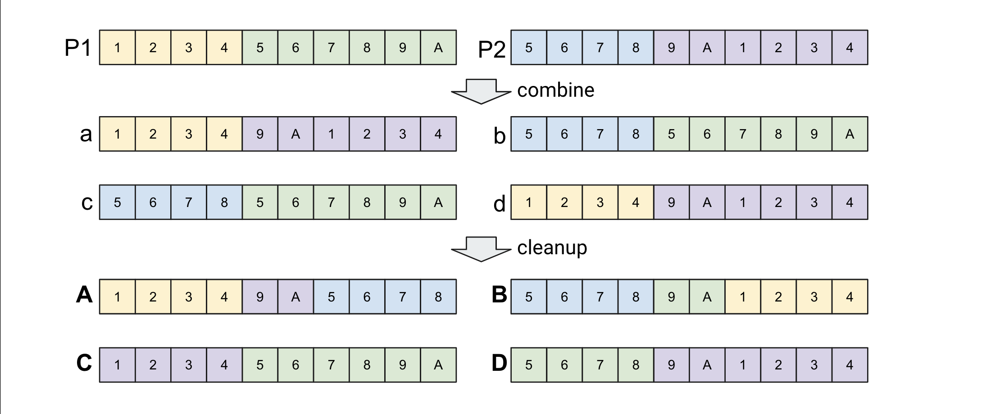

# Project: GA

Genetic Algorithm experimental

- Solving TSP(Travelling Salesman Problem) by using GA.
- The sample tsp samples can be found via [MP-TESTDATA](http://elib.zib.de/pub/mp-testdata/tsp/tsplib/tsp/index.html)


## How To Run

* install the required modules  (`node` and `npm` is required!)

    ```sh
    $ npm install
    ```

* run GA to find TSP route (see `Run Arguments` Section)

    ```sh
    #WARN! must add '--' for arguments.
    $ npm start -- -p 20 -f 200 burma14.tsp
    ```


### Run Arguments

| Name      | Description   |
|--         |--             |
| p         | Number of population per each generation |
| f         | Budget count of fitness |


## How Works

**[Overview]**

1. Read `.tsp` file, and build distance map between each points.
1. Make random populations with `randomSol()`
1. [_Elitism_] make some offsprings from `best` solution. (see `data/best.json`)
1. Select 2 parents by tournament (K=8).
1. Make 2 offsprings by crossover & move of each parents (see [Self Crossover](#self-crossover)).
1. Make 4 offsprings by combination of parents (see [Mate Crossover](#mate-crossover)).
1. Mutate each offsprings (see [Mutate](#mutate)).
1. Add offsprings to population, and remove the duplicated route.
1. Sort by `fitness`, then cut-off population (see [Fitness](#fitness)).
1. Select the `best` solution, and store in json file.
1. Do loop to `#3` until budget limitation.


### Crossover

- exchange the range of route with the different position.


#### Self Crossover

select the random range from A to B of single instance, then reverse and move by random position.



```ts
    public crossover = ($sol: Solution, rnd?: (i: number) => number): Solution => {
        const { sol: org } = $sol;
        const LEN = org.length;
        const a = rnd ? rnd(0) : random.randint(1, LEN - 1);
        const b = rnd ? rnd(1) : random.randint(1, LEN - 1);
        const [A, B] = [a, b].sort();
        const sol =
            A >= B
                ? org.slice(0, A).concat(org.slice(A).reverse())
                : org
                        .slice(0, A)
                        .concat(org.slice(A, B).reverse())
                        .concat(org.slice(B));
        return { fit: 0, sol };
    };
```


#### Mate Crossover

select the random position, then swap between 2 instances in order to generate offsprings (x4).




```ts
    public crossover2 = (p1: Solution, p2: Solution, rnd?: (i: number) => number) => {
        const { sol: org } = p1;
        const LEN = org.length;
        const x = rnd ? rnd(0) : random.randint(1, LEN - 1);
        if (x < 1 || x > LEN - 1) throw new Error(`@x[${x}] is out of range[1,${LEN - 1}]`);
        const [a, b] = [p1.sol.slice(0, x), p1.sol.slice(x)];
        const [c, d] = [p2.sol.slice(0, x), p2.sol.slice(x)];
        const A = a.concat(d.filter(i => !a.includes(i))).concat(c.filter(i => !a.includes(i)));
        const B = b.concat(c.filter(i => !b.includes(i))).concat(d.filter(i => !b.includes(i)));
        const C = c.concat(b.filter(i => !c.includes(i))).concat(a.filter(i => !c.includes(i)));
        const D = d.concat(a.filter(i => !d.includes(i))).concat(b.filter(i => !d.includes(i)));
        return { A, B, C, D };
    };
```

### Mutate

swap by neighbor pairs with `epsilon` probability in single instance.


```ts
    public mutate = ($sol: Solution, epsilon: number, rnd?: (i: number) => number): Solution => {
        rnd = rnd || (() => random.random());
        const { sol: org } = $sol;
        const sol = [...org];
        const LEN = sol.length;
        const len = Math.floor(LEN / 2);
        const off = rnd(0) < 0.5 ? 1 : 0; // offset of odd/even.
        range(len).forEach(i => {
            const r = rnd(i);
            if (r < epsilon) {
                const j = i * 2 + off;
                const L = sol.slice(j, j + 2);
                if (L.length == 2) {
                    const [a, b] = L;
                    sol[j] = b;
                    sol[j + 1] = a;
                }
            }
        });
        return { fit: 0, sol };
    };
```

### Fitness

calculate the total traveling distance of instance. (use the internal distance metrics).

```ts
    public fitness = (indices: number[]) =>
        indices
            .map((a, i) => {
                const b = !i ? indices[indices.length - 1] : indices[i - 1]; //! point to the very first node if is last.
                return this.distByIndex(a, b);
            })
            .reduce((T, d) => T + d, 0);
```

## Result


| TSP       | Dimension | Best Travel Distance(*) |
| ---       |   :---:   |          ---: |
| burma14   | 14        | 33.92         |
| bier127   | 127       | 118325.39     |

* NOTE _it would **NOT** be the global best_.


## LICENSE

GA is licensed under the MIT License.
See [LICENSE](LICENSE) for full license text.

## Author

[Steve](steve@lemoncloud.io)
